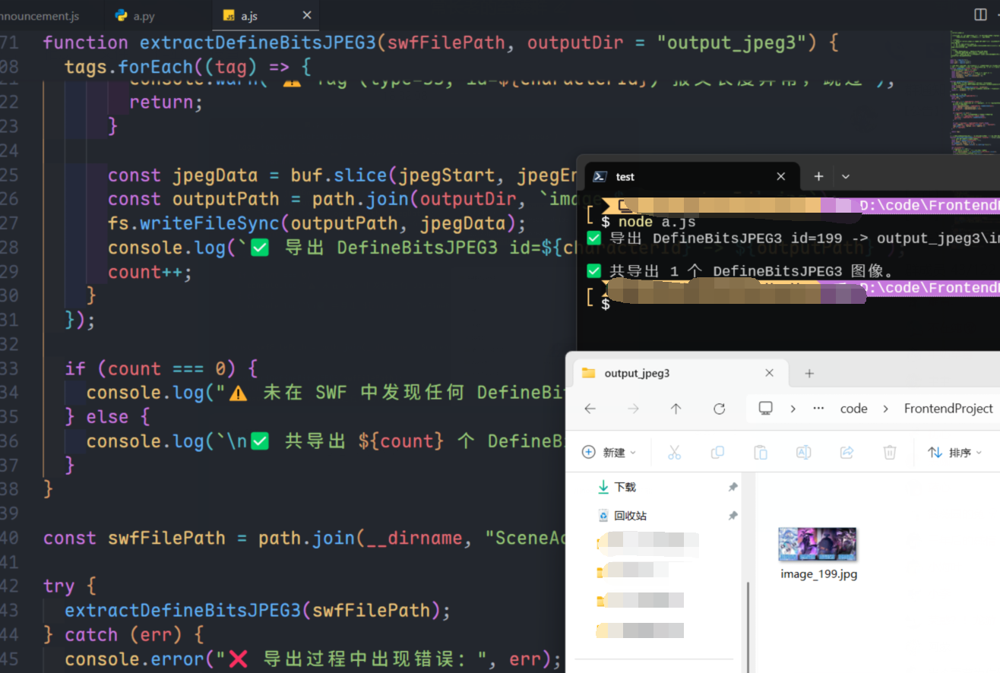

# Seer-preview-img-dumper

Flash也是半截身子入土了，欢迎查看解析Unity端预告图片的新项目

<https://github.com/WhY15w/seer-unity-preview-img-dumper>


🎯 一个用于从 `.swf` Flash 文件中提取赛尔号下周预告的 Node.js 工具。

> **此为赛尔号信息聚合页的一个子功能的衍生项目**

[](https://nodejs.org/)
[](LICENSE)
[](https://github.com/WhY15w/seer-swf-jpeg3-dumper/issues)
[](https://github.com/WhY15w/seer-swf-jpeg3-dumper/stargazers)

_感谢 GitHub Copilot 的帮助_ 🤖

> 支持自动导出 SWF 文件中的嵌入式 JPEG/PNG 图像，可替代 JPEXS 等手动操作流程。

---

## 📸 最新预告图片


## ✨ 功能特点

- ✅ 提取 SWF 中的 `DefineBitsJPEG3`（Tag 35）和 `DefineBitsLossless2`（Tag 36）图像资源
- 🧠 基于 Node.js，无需依赖 Adobe 工具
- 🗂️ 自动将图像保存为 `.jpg` 和 `.png` 格式
- 🎛️ 支持自定义压缩质量和尺寸
- 📊 生成详细的提取报告
- 🚀 命令行界面，支持多种参数
- 🔄 自动重试机制和错误处理
- 📈 显示压缩率和文件大小统计

---

## 📦 安装与使用

### 安装依赖

```bash
npm install
```

### 基本使用

```bash
# 默认提取 (质量75%, 最大宽度1024px)
npm start

# 或者直接运行
node index.js
```

### 命令行参数

```bash
# 自定义压缩质量
node index.js --quality 90

# 自定义输出目录
node index.js --output ./my-images

# 设置最大图片宽度
node index.js --width 2048

# 保存原始图片
node index.js --save-original

# 仅下载SWF文件
node index.js --download-only

# 开发模式(显示详细日志)
node index.js --dev

# 显示帮助
node index.js --help
```

### 可用脚本

```bash
npm run start        # 启动程序
npm run dev          # 开发模式
npm run extract      # 仅提取模式
npm run download     # 仅下载模式
```

---

## 🔧 配置

程序使用 `config/default.json` 配置文件，支持以下配置项：

```json
{
  "swf": {
    "url": "SWF文件下载地址",
    "downloadDir": "./swf",
    "outputDir": "./output"
  },
  "image": {
    "quality": 75,
    "maxWidth": 1024,
    "formats": ["jpeg", "png"],
    "saveOriginal": false
  },
  "network": {
    "timeout": 30000,
    "retries": 3
  }
}
```

---

## 📊 输出报告

程序会在输出目录生成 `extraction_report.json` 报告文件，包含：

- 提取的图片数量
- 原始和压缩后的文件大小
- 压缩率统计
- 每个文件的详细信息

---

## 🧠 效果展示

下图为导出赛尔号下周预告的图片



---

## 🚀 自动同步

本项目配置了 GitHub Actions 工作流，会在每周五的北京时间 12:00 和 15:00 自动获取最新的预告图片，并更新到本 README 文档中。

- ⏰ 自动执行时间：每周五 12:00 和 15:00 (北京时间)
- 📁 图片保存路径：`./images/` 目录
- 🔄 历史图片会被保留作为备份

---

## ⚙️ 工作原理

该工具直接读取 SWF 的二进制结构，解析出 DefineBitsJPEG3 和 DefineBitsLossless2 标签，并将其中嵌入的图像数据提取出来保存为图片文件。相当于自动化 JPEXS 中手动导出的过程。

### 支持的图像格式

- **DefineBitsJPEG3** (Tag 35): JPEG 图像带 Alpha 通道
- **DefineBitsLossless2** (Tag 36): 无损压缩位图带 Alpha 通道

---

## 🛠️ 开发

### 目录结构

```
├── config/          # 配置文件
├── utils/           # 工具模块
│   ├── extractImg.js    # 图像提取核心逻辑
│   ├── getImgInfo.js    # SWF下载和处理
│   ├── logger.js        # 日志工具
│   └── config.js        # 配置管理
├── swf/             # SWF文件下载目录
├── output/          # 图片输出目录
└── index.js         # 主程序入口
```

### 贡献

欢迎提交 Issue 和 Pull Request！

---

## 📄 许可证

ISC License
